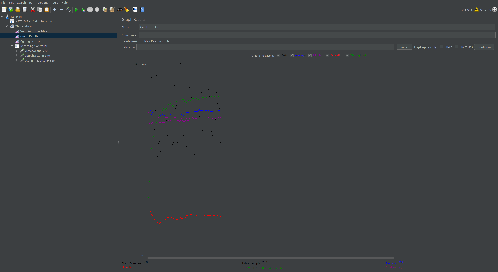
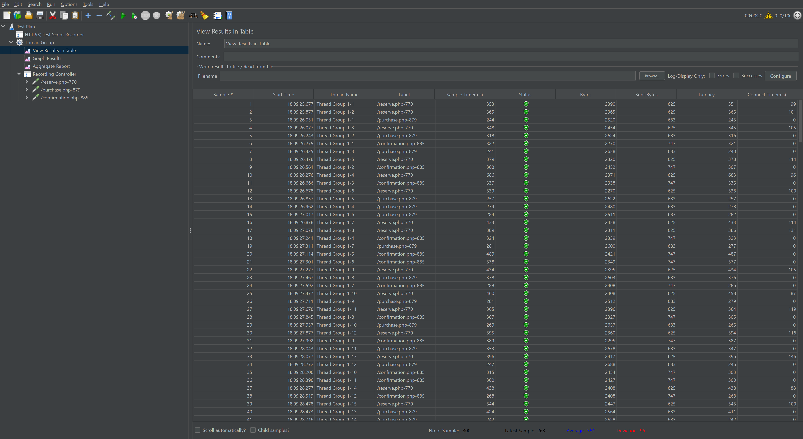
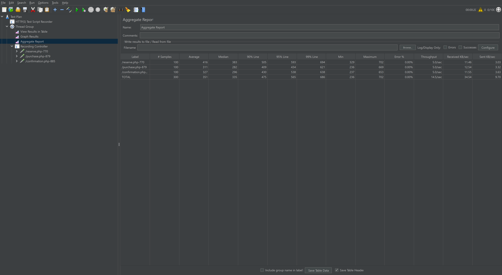
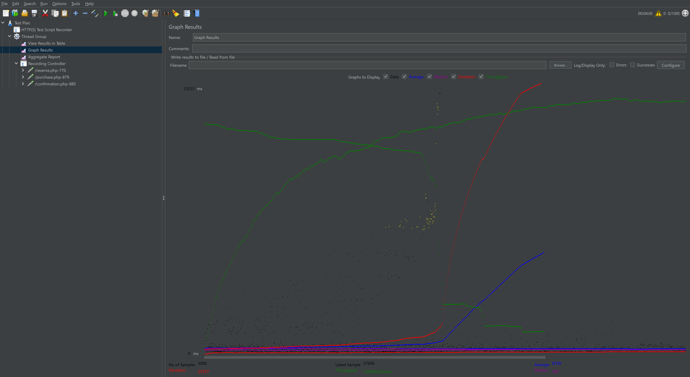
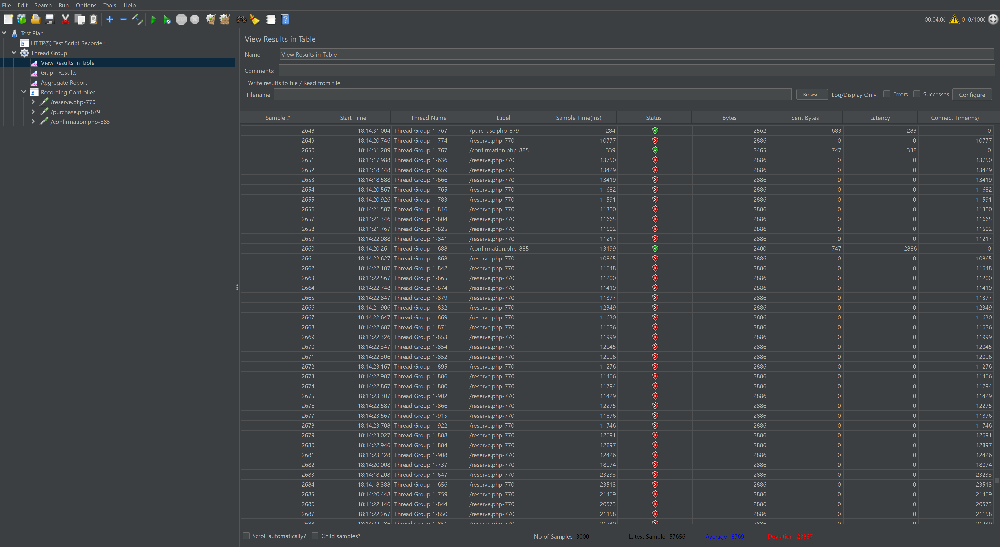
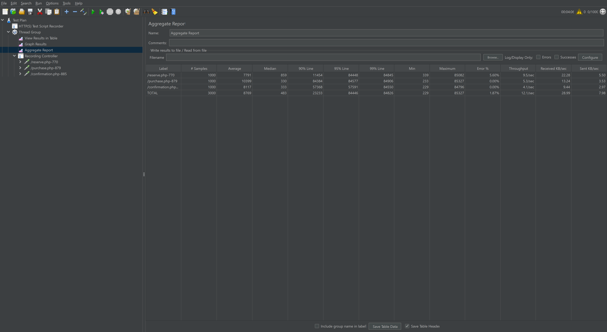

## Do testów została użyta aplikacja internetowa (https://blazedemo.com), w której testowane były trzy fukcjonalności rezerwację, zakup i potwierdzenie zamówienia.

/reserve.php - Rezerwacja  
/purchase.php - Zakup  
/confirmation.php - Potwierdzenie  

## Parametry testów  

Scenariusz 1: 1000 użytkowników, ramp-up 20 sekund  
| /reserve.php: | 770 r/s, | średni czas odpowiedzi 8.791s, | błąd 859 |  
| /purchase.php: | 879 r/s,| średni czas odpowiedzi 10.399s,| błąd 330 |  
| /confirmation.php: | 885 r/s, | średni czas odpowiedzi 8.117s, | błąd 333 |  
Ogółem:  3000 użytkowników, | średni czas odpowiedzi 8.769s, | błąd 483 |  

Scenariusz 2: 100 użytkowników, ramp-up 20 sekund  
| /reserve.php: | 770 r/s, | średni czas odpowiedzi 0.429s, | błąd 400 |  
| /purchase.php: | 879 r/s, | średni czas odpowiedzi 0.32s, | błąd 290 |  
| /confirmation.php: | 885 r/s, | średni czas odpowiedzi 0.334s, | błąd 310 |  
Ogółem: 300 użytkowników, | średni czas odpowiedzi 0.361s, | błąd 345 |  

## Analiza wyników  

Scenariusz 1 (1000 użytkowników)  
Aplikacja zaczęła wykazywać anomalia przy 1000 użytkowników, gdzie średni czas odpowiedzi znacznie wzrósł (8.769s), a liczba błędów wyniosła 483.   Aplikacja prawdopodobnie zaczęła zwalniać i nie odpowiadać efektywnie na tak dużą liczbę żądań.

Scenariusz 2 (100 użytkowników)  
Przy mniejszym obciążeniu (100 użytkowników) aplikacja działała znacznie efektywniej, ze średnim czasem odpowiedzi wynoszącym 0.361s i niewielką liczbą błędów (345).   Aplikacja wydaje się być w stanie obsłużyć to obciążenie.

## Wnioski  
Aplikacja wydaje się działać poprawnie do pewnego stopnia obciążenia. W przypadku 100 użytkowników, jej wydajność była zadowalająca.  
W scenariuszu z 1000 użytkownikami pojawiły się znaczne problemy z wydajnością, co objawiało się znacznym wzrostem średniego czasu odpowiedzi i liczbą błędów.  
Długi czas odpowiedzi i duże ilości błędów mogą wskazywać na problemy z infrastrukturą, konieczność optymalizacji kodu aplikacji lub zasobami serwera.  

*Graph Results - 100 users*

*View Results in Table - 100 users*

*Aggregate Report - 100 users*

*Graph Results - 1000 users*

*View Results in Table - 1000 users*

*Aggregate Report - 1000 users*

